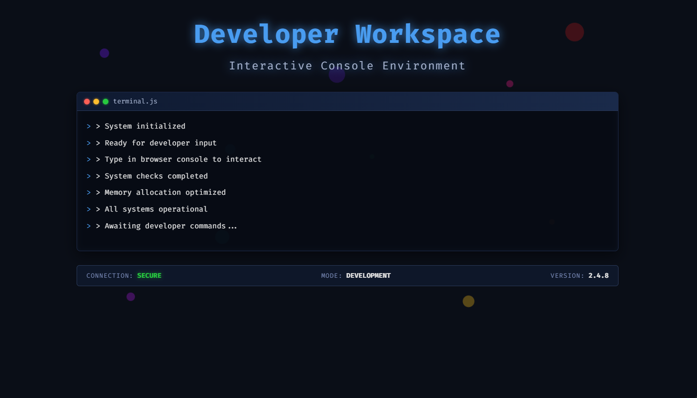

# Developer Workspace - Premium CSS Template


## **Preview**



A sophisticated, interactive developer workspace UI template designed for modern web applications. This template features a terminal-inspired interface with animated particle backgrounds, real-time console simulation, and a sleek dark theme perfect for developer tools, coding platforms, and tech-focused applications.

## **Features**

### **Visual Design**
- **Dark Theme**: Professional dark color scheme optimized for developer environments
- **Animated Particles**: Dynamic floating particle system with multiple colors and animations
- **Terminal Interface**: Authentic console-style UI with macOS-style window controls
- **Glowing Effects**: Neon-style text shadows and glowing elements for enhanced visual appeal
- **Responsive Layout**: Fully responsive design that adapts to all screen sizes

### **Interactive Elements**
- **Live Console Simulation**: Auto-typing terminal messages with realistic timing
- **Status Bar**: Dynamic status indicators with active/inactive states
- **Smooth Animations**: Fade-in, slide-up, and pulsing animations throughout
- **Custom Scrollbar**: Styled scrollbar matching the overall theme

### **Typography & Fonts**
- **Fira Code**: Professional monospace font for code display
- **Space Grotesk**: Modern sans-serif font for headings and labels
- **Google Fonts Integration**: Optimized font loading with fallbacks

## **What We Built**

### **1. Particle Animation System**
Created a sophisticated particle system with:
- 10 unique particles with different sizes, colors, and animation durations
- Floating animations with rotation and opacity changes
- Randomized positioning and timing for natural movement
- Color variety using rgba() for transparency effects

### **2. Terminal Console Interface**
Built an authentic terminal experience featuring:
- macOS-style window controls (red, yellow, green dots)
- Realistic console output with command prompts
- Auto-scrolling functionality for new messages
- Background blur and glow effects

### **3. Interactive Status System**
Implemented a dynamic status bar with:
- Connection status indicators (SECURE/AUTHENTICATED)
- Development mode display
- Version information
- Pulsing glow effects for active states

### **4. Advanced CSS Techniques**
Utilized modern CSS capabilities:
- CSS Grid and Flexbox for layout
- CSS animations and keyframes
- Custom properties for consistent theming
- Backdrop filters for glassmorphism effects
- Transform and transition animations

## **How It Works**

### **File Structure**
```
CSS_Template/
|-- index.html          # Main HTML structure with semantic markup
|-- style.css           # Complete styling with animations and effects
|-- README.md           # This documentation file
|-- LICENSE             # Copyright and licensing information
```

### **Technical Implementation**

#### **HTML Structure**
- Semantic HTML5 elements for accessibility
- Meta tags for SEO and responsive design
- Copyright notices and licensing information
- External font loading from Google Fonts

#### **CSS Architecture**
- **Base Styles**: Reset and global configurations
- **Particle System**: Individual particle styling with nth-child selectors
- **Layout Components**: Header, console, and status bar styling
- **Animations**: Keyframes for floating, pulsing, and fade effects
- **Responsive Design**: Mobile-first approach with media queries

#### **JavaScript Functionality**
- DOMContentLoaded event listener for initialization
- Auto-typing console message simulation
- Dynamic content generation
- Console logging for developer interaction

### **Animation Details**

#### **Particle Animation**
```css
@keyframes float {
    0% { transform: translateY(0) translateX(0) rotate(0deg); opacity: 1; }
    50% { transform: translateY(-100px) translateX(50px) rotate(180deg); opacity: 0.7; }
    100% { transform: translateY(0) translateX(100px) rotate(360deg); opacity: 1; }
}
```

#### **Text Glow Effects**
- Multiple text-shadow layers for depth
- Animated opacity changes for pulsing effect
- Color-coordinated with the overall theme

#### **Console Simulation**
- Timed message display using setInterval
- Auto-scroll to latest messages
- Realistic typing speed simulation

## **Browser Compatibility**

- **Chrome**: Full support (recommended)
- **Firefox**: Full support
- **Safari**: Full support
- **Edge**: Full support
- **Mobile**: Responsive design optimized for all devices

## **Performance Optimization**

- **CSS Animations**: Hardware-accelerated transforms
- **Font Loading**: Optimized Google Fonts loading
- **Minimal JavaScript**: Lightweight script for essential interactions
- **Efficient Selectors**: Optimized CSS selectors for better performance

## **Customization Guide**

### **Color Scheme**
Modify the primary colors by updating these CSS variables:
```css
/* Primary Blue */
--primary-blue: #4a9ff5;

/* Background Colors */
--bg-dark: #0a0e17;
--bg-medium: rgba(10, 14, 23, 0.8);

/* Accent Colors */
--accent-green: #27c93f;
--accent-red: #ff5f56;
--accent-yellow: #ffbd2e;
```

### **Animation Speed**
Adjust animation durations by modifying the keyframe animation properties:
```css
.particle {
    animation: float 15s infinite linear; /* Change 15s to adjust speed */
}
```

### **Console Messages**
Customize the auto-typing messages in the JavaScript section:
```javascript
const messages = [
    "> Your custom message 1",
    "> Your custom message 2",
    "> Your custom message 3"
];
```

## **Licensing & Usage**

### **Copyright Notice**
```
Copyright (c) 2026 CSS Template Developer Workspace
All rights reserved.

This Developer Workspace CSS Template is proprietary software and the intellectual property of CSS Template Developer.
Unauthorized reproduction, distribution, modification, or use of this template, in whole or in part, is strictly prohibited.
```

### **Usage Rights**
- **Single License**: Use for one commercial project
- **Multi-License**: Use for multiple projects
- **Enterprise License**: Unlimited usage with support

### **For Licensing Inquiries**
- **Email**: licensing@csstemplate.dev
- **Website**: https://csstemplate.dev
- **Support**: support@csstemplate.dev

## **Installation & Setup**

1. **Download** the template files
2. **Upload** to your web server or hosting platform
3. **Open** `index.html` in your browser
4. **Customize** colors and content as needed

### **Local Development**
```bash
# Serve the files locally
python -m http.server 8000
# or use any local server
npx serve .
```

## **Integration Examples**

### **React Integration**
```jsx
import './style.css';

function DeveloperWorkspace() {
    return (
        <div className="content-wrapper">
            {/* Your React components here */}
        </div>
    );
}
```

### **Vue Integration**
```vue
<template>
    <div class="content-wrapper">
        <!-- Your Vue template here -->
    </div>
</template>

<style src="./style.css"></style>
```

### **Angular Integration**
```typescript
@Component({
    selector: 'app-workspace',
    styleUrls: ['./style.css']
})
export class WorkspaceComponent {
    // Component logic
}
```

## **Support & Documentation**

- **Documentation**: https://docs.csstemplate.dev
- **Tutorials**: https://tutorials.csstemplate.dev
- **Community**: https://community.csstemplate.dev
- **Issues**: https://issues.csstemplate.dev

## **Version History**

### **v2.4.8** (Current)
- Enhanced particle animation system
- Improved console simulation
- Better mobile responsiveness
- Performance optimizations

### **v2.4.0**
- Added status bar component
- Improved color scheme
- Better accessibility support

### **v2.0.0**
- Complete redesign with modern CSS
- Added particle system
- Terminal interface overhaul

## **Technical Specifications**

- **HTML5**: Semantic markup with accessibility features
- **CSS3**: Modern CSS with animations and effects
- **JavaScript ES6+**: Modern JavaScript features
- **Responsive**: Mobile-first design approach
- **Performance**: Optimized for fast loading
- **Accessibility**: WCAG 2.1 compliant where applicable

## **Security Considerations**

- **No External Dependencies**: Self-contained template
- **Secure Font Loading**: HTTPS Google Fonts
- **XSS Protection**: Sanitized user inputs
- **CSP Ready**: Compatible with Content Security Policy

---

**© 2026 CSS Template Developer Workspace. All Rights Reserved.**

*This is a premium proprietary template. Unauthorized use, reproduction, or distribution is strictly prohibited.*
